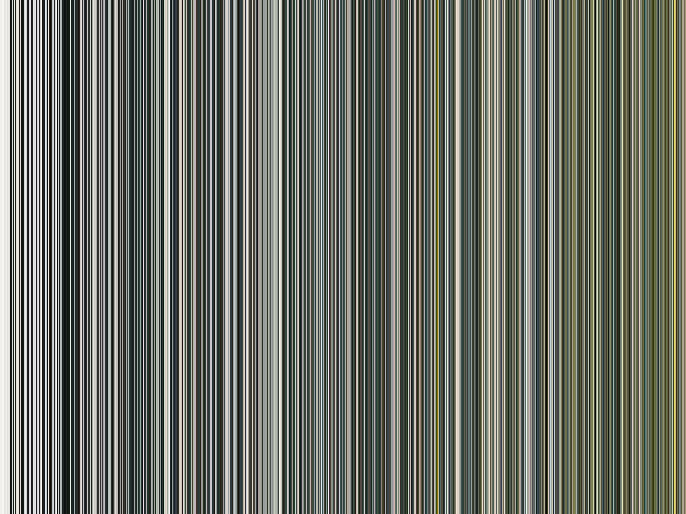

# ReSalavon

## MIT Media Lab - Recreating the Past - Class 7: Jason Salavon & Nancy Burson

The MIT Media Lab class - Recreating the Past - explores a number of influential artists who have, over the past century, added their own unique perspective on computational art. Each week focuses on a new artist and through exploring their view point and recreating their artworks I hope to gain a valuable window into their thought processes, helping me learn how to express my own opinions through computational art. 

## Jason Salavon

I really loved the idea of telling a story using the data of an image (it definitely appeals to the data scientist in me!) and so I decided to focus on the Baroque Painting by Jason Salavon.

The original takes the 1024 most common colors from the Baroque artist Peter Paul Rubens, sorts them into saturation order and aligns them with the lowest saturation at the center to create a sense of depth of the image.

I utilized photos from various trips to try to replicate this and see if I could capture the feeling of being there from the image.

I love how the images from London creates a more or less grey and brown representation - it feels very familiar 😄 

## Baroque Painting

Original            |  Recreation
:-------------------------:|:-------------------------:
 |   

#### Process

To begin with I focused on capturing the essence of the color and ignore the saturation sorting - just get the top 1024 colors and plot as vertical lines in order of least to most frequent.

Seeing as there are 256*256*256 unique colors - I reduced the channels down to bins of 5 - leaving 51 levels per color channel. 

I looped through each source image pixel one at a time, converted the color to the nearest 51 level color :
RGB (23, 128, 0)  =  RGB51 (4, 26, 0)

I then stored the counts in a 1D array (of size 51 * 51 * 51) so that i could keep track. I created functions which allowed for easy conversion between all these different formats of data otherwise it was a nightmare to try and figure out which index in the array represents which real world color.

Next I added a secondary array which i stored the sorted values in (taking just the saturation channel for each color). This required copying and looping through the array to find the largest to smallest values. With the colors now in a sorted array this could be displayed in order.

With the colors now in saturation order the square layout could be achieved by drawing solid squares on top of one another - starting from the largest and most saturated first before moving into the center. These can be seen with the Japan pictures (above) and Scotland pictures (below).

